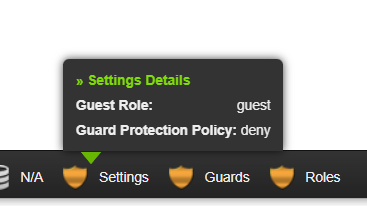
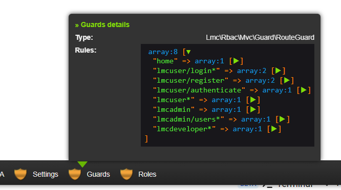
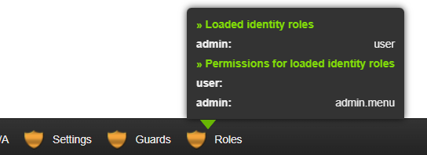

# Debugging Tools

[LmcRbacMvcDeveloperTools](https://github.com/LM-Commons/LmcRbacMvcDeveloperTools) is an extension
for the [Laminas Developer Tools](https://github.com/laminas/laminas-developer-tools), 
that collects and displays debugging data on settings, guards and roles.

## Installation

```shell
$ composer require --dev lm-commons/lmc-rbac-mvc-devtools
```

Composer should ask to install the module. Typically, this module will go in `development.config.php`.

## Toolbar

LmcRbacMvcDeveloperTools provides toolbars to view settings, guards and roles:




